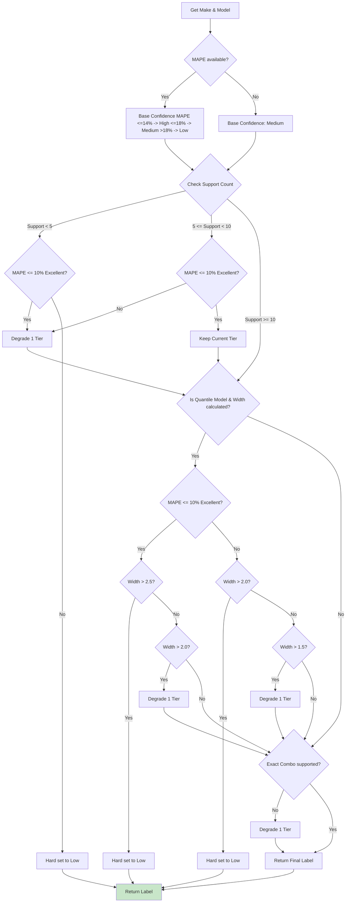
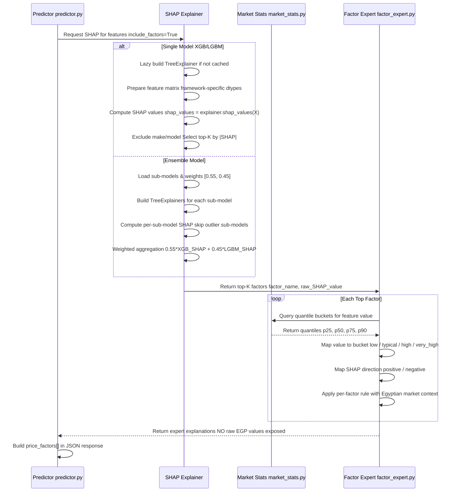
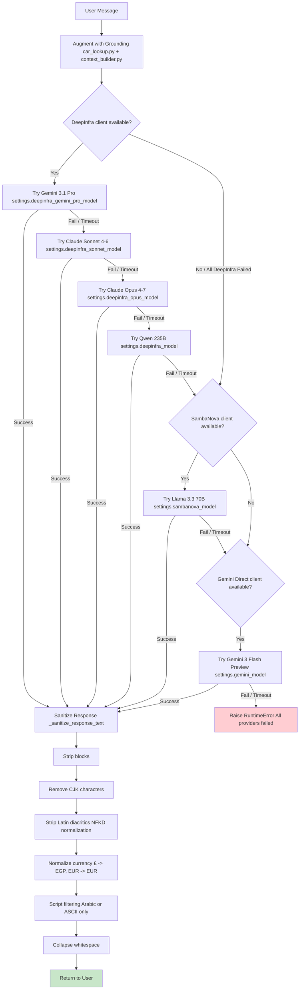

# Chapter 4 — Mermaid Diagrams Collection

> All Mermaid diagrams for **Mohamed Seif's sections**: ML/AI architecture, data pipeline, prediction flow, retrain workflow, chatbot flow, and system communication.

---

## Diagram 1: Overall System Architecture

```mermaid
graph TD
    Client[Client UI / Backend API] -->|POST /api/v1/predict| MLService[FastAPI ML Service :8001]
    Client -->|POST /api/v1/chat| AIService[FastAPI AI Service :8000]

    subgraph ml-service [ML Pricing Subsystem]
        MLService --> Router[router.py Fallback Routing]
        Router -->|1 Resolve| ModelState[model_state.py VALID_CARS, SUPPORT_COUNTS]
        MLService -->|2 Build Features| FeatureBuilder[feature_builder.py 5-Priority Spec Lookup]
        FeatureBuilder --> SpecCSV[(car_specs_lookup_full_cleaned.fixed.csv)]
        MLService -->|3 Predict| Predictor[predictor.py predict_full()]
        Predictor -->|Robust Average| Ensemble[Ensemble XGB 0.55 + LGBM 0.45]
        Ensemble --> XGBPickle[(XGB Quantile 5 sub-models)]
        Ensemble --> LGBMPickle[(LGBM Quantile 5 sub-models)]
        MLService -->|4 Confidence| Confidence[confidence.py Signal Cascade]
        Confidence --> MapeCSV[(make_model_mape.csv)]
        MLService -->|5 Explainability| Explainer[explainer.py / ensemble_explainer.py]
        Explainer --> FactorExpert[factor_expert.py + market_stats.py]
    end

    subgraph ai-service [AI Conversational Subsystem]
        AIService --> LLMService[llm_service.py Singleton]
        LLMService -->|Fuzzy Lookup| CarLookup[car_lookup.py rapidfuzz]
        CarLookup --> LookupCSV[(AI_lookup.csv)]
        LLMService -->|Build Context| ContextBuilder[context_builder.py]
        LLMService -->|Fallbacks| FallbackChain{LLM Fallback Chain}
        FallbackChain -->|1| DeepInfra[DeepInfra Gemini Pro > Sonnet > Opus > Qwen]
        FallbackChain -->|2| SambaNova[SambaNova Llama 3.3 70B]
        FallbackChain -->|3| GeminiSDK[Gemini Flash Preview]
    end
```

**Where to place:** Section 4.1 Software Architecture overview.

---

## Diagram 2: ML Model Architecture

```mermaid
flowchart TD
    subgraph Training [Offline Training]
        Raw[(processed_data.csv)] --> Split[Train/Val/Test Split price_stratified 70/15/15]
        Split -->|Train| XGBTrain[XGBoost Quantile 5 sub-models]
        Split -->|Train| LGBMTrain[LightGBM Quantile 5 sub-models]
        XGBTrain --> XGBDict[xgb_quantile_tag.joblib]
        LGBMTrain --> LGBMDict[lgbm_quantile_tag.joblib]
        XGBDict --> EnsembleWrapper[ensemble_tag.joblib weights [0.55, 0.45]]
        LGBMDict --> EnsembleWrapper
        EnsembleWrapper --> Registry[model_registry.json stage: candidate]
        EnsembleWrapper --> HoldoutEval[Holdout Evaluation MAPE, R2, within_15pct]
        EnsembleWrapper --> CVCV[5-Fold CV OOF predictions]
        HoldoutEval --> Gate{Promotion Gate}
        CVCV --> Gate
        Gate -->|pass| Promote[promote_active_model stage: production]
        Gate -->|fail| Reject[Reject candidate_only]
    end

    subgraph Inference [Online Inference]
        Request[API Request] --> FeatureEng[feature_builder.py spec lookup + derived features]
        FeatureEng --> FrameworkPrep{Framework?}
        FrameworkPrep -->|XGBoost| XGBPrep[LabelEncoder unseen -> -1]
        FrameworkPrep -->|LightGBM| LGBMPrep[category dtype]
        FrameworkPrep -->|Ensemble| BothPrep[Both preparations]
        XGBPrep --> XGBPred[XGB Quantile Predict q05..q95]
        LGBMPrep --> LGBMPred[LGBM Quantile Predict q05..q95]
        BothPrep --> XGBPred
        BothPrep --> LGBMPred
        XGBPred --> Weighted[Weighted Average 0.55*XGB + 0.45*LGBM]
        LGBMPred --> Weighted
        Weighted --> FairPrice[fair_price = q50_median]
        FairPrice --> Confidence[compute_confidence_label]
        Confidence --> Negotiation[compute_negotiation_range]
        Negotiation --> Round[price_rounding <200k->5k, >=200k->10k]
        Round --> Response[JSON Response]
    end

    EnsembleWrapper -.->|Load at startup| Inference
```

**Where to place:** Section 4.1.1 Model Family and Inference Pipeline.

---

## Diagram 3: ML Service Layered Architecture

```mermaid
flowchart TD
    subgraph API_Layer [API Layer]
        PredictEndpoint[/api/v1/predict]
        BatchEndpoint[/api/v1/predict/batch]
        HealthEndpoint[/health]
        MetricsEndpoint[/metrics]
        AdminEndpoints[/admin/models/*]
    end

    subgraph Orchestration [Prediction Orchestration]
        Predictor[predictor.py predict_full()]
        Validator[Request Validation]
        FallbackRouter[router.py RoutingResult]
    end

    subgraph Services [Services Layer]
        FeatureBuilder[feature_builder.py 5-priority spec lookup]
        ConfidenceService[confidence.py Signal Cascade]
        IntervalService[intervals.py alpha computation]
        ExplainerService[explainer.py / ensemble_explainer.py]
        FactorExpert[factor_expert.py Rule-based explanations]
    end

    subgraph Core [Core / State Layer]
        ModelState[model_state.py ModelContext abstraction]
        ModelRegistry[model_registry.py Registry v2]
        Settings[config.py Pydantic Settings]
        Metrics[metrics.py Prometheus counters]
        Middleware[middleware.py CORS + Logging + Metrics]
    end

    subgraph Data [Data / Config Layer]
        ProcessedCSV[(processed_data.csv)]
        SpecLookupCSV[(car_specs_lookup_full_cleaned.fixed.csv)]
        RegistryJSON[(model_registry.json)]
        Pickles[(models/pickles/*.joblib)]
    end

    API_Layer --> Orchestration
    Orchestration --> Services
    Services --> Core
    Core --> Data

    style ModelState fill:#e1f5fe
```

**Where to place:** Section 4.1 Software Architecture ML service internals.

---

## Diagram 4: Data Pipeline

```mermaid
flowchart LR
    subgraph Sources [Data Sources]
        Hatla2ee[Hatla2ee Listings]
        Dubizzle[Dubizzle Listings]
    end

    subgraph Scraping [Scraping Layer]
        Scrapers[Scraping Scripts] --> Supabase[(Supabase Raw Storage)]
    end

    subgraph Cleaning [Cleaning Layer]
        RawCSV[(cars_with_make_model.csv)]
        RawCSV --> S1[Stage 1: Canonicalization wrong-pair fixes]
        S1 --> S2[Stage 2: EV/Hybrid Fixes]
        S2 --> S3[Stage 3: Year Cleaning 1975-current_year]
        S3 --> S4[Stage 4: Deduplication]
        S4 --> S5[Stage 5: IQR Outlier Removal per brand+model 1.5x IQR]
        S5 --> S6[Stage 6: Merge Validation]
    end

    subgraph Processing [Processing Layer]
        Cleaned --> Bounds[Hard Bounds price 20k-20M, mileage <=500k]
        Bounds --> Fraud[Odometer Fraud Filters old car + low km -> drop]
        Fraud --> Impute[Fuel/Transmission Imputation mode hierarchy]
        Impute --> LocNorm[Location Normalization 17 Egyptian categories]
        LocNorm --> MergeSpecs[Merge Specs Lookup exact -> nearest-year fallback]
        MergeSpecs --> Derive[Derived Features car_age, mileage_per_year, price_egp_log]
        Derive --> RareDrop[Drop Rare Groups < 5 rows per make+model]
        RareDrop --> Output[(processed_data.csv 18 columns)]
    end

    Sources --> Scraping
    Scraping --> RawCSV
    S6 --> Cleaned
    Output --> Retrain[Retrain Pipeline]
    Output --> Startup[ML Service Startup load_valid_cars()]

    style Output fill:#c8e6c9
```

**Where to place:** Section 4.1 and 4.2 Data pipeline and cleaning workflow.

---

## Diagram 5: Production Prediction Request Flow

```mermaid
flowchart TD
    A[Client Request POST /api/v1/predict] --> B{Pydantic Validation}
    B -->|Fails| C[422 Validation Error]
    B -->|OK| D[Resolve Routing router.py]
    D -->|Make Unknown| E[400 Validation Error]
    D -->|Known Make| F{Model in VALID_CARS?}
    F -->|Yes| G[Exact Match exact_combo_supported=True]
    F -->|No| H[Fallback Routing exact_combo_supported=False]
    G --> I[Feature Engineering 5-priority spec lookup]
    H --> I
    I --> J{Framework Dispatch}
    J -->|Ensemble| K[Load XGB + LGBM sub-models]
    J -->|Single| L[Load sklearn estimator + preprocessor]
    K --> M[Predict Quantiles q05..q95]
    L --> N[Predict Point single_value]
    M --> O[Ensemble Aggregation Weighted Average 0.55/0.45]
    O --> P[Extract fair_price q50 median]
    N --> P
    P --> Q[Compute Confidence Label confidence.py]
    Q --> R[MAPE Tier Signal]
    R --> S[Support Count Signal]
    S --> T[Interval Width Signal quantile models only]
    T --> U[Exact-Combo Flag degrade if fallback]
    U --> V[Final Label high / medium / low]
    V --> W[Compute Negotiation Range intervals.py]
    W --> X[alpha = max(mape*multiplier, min_band)]
    X --> Y[min_price = fair_price * (1 - a)]
    X --> Z[max_price = fair_price * (1 + a)]
    Y --> AA{Price Rounding}
    Z --> AA
    AA -->|fair_price < 200k| AB[Round to nearest 5,000 EGP]
    AA -->|fair_price >= 200k| AC[Round to nearest 10,000 EGP]
    AB --> AD{include_factors?}
    AC --> AD
    AD -->|Yes| AE[SHAP Explainability explainer.py / ensemble_explainer.py]
    AD -->|No| AF[Skip SHAP]
    AE --> AG[Factor Expert factor_expert.py]
    AF --> AH[Build JSON Response]
    AG --> AH
    AH --> AI[Record Metrics prediction_requests_total]
    AI --> AJ[Audit Log predictions.jsonl]
    AJ --> AK[Return JSON Response]

    style AK fill:#c8e6c9
```

**Where to place:** Section 4.2 Production Inference Flow.

---

## Diagram 6: Confidence Label Computation



**Where to place:** Section 4.1.4 Confidence Label Computation.

---

## Diagram 7: SHAP Explainability Sequence



**Where to place:** Section 4.1.6 Explainability via SHAP.

---

## Diagram 8: Retrain Orchestration Workflow

```mermaid
flowchart TD
    A[Start Retrain scripts/retrain/run.py] --> B[Parse Config RetrainConfig dataclass]
    B --> C[Load Data dataset_tag or explicit path]
    C --> D[Validate DataFrame schema + quality checks]
    D -->|Fails| E[Exit with Error]
    D -->|OK| F[Split Dataset price_stratified 70/15/15]
    F --> G[Train XGBoost Quantile 5 quantiles, reg:quantileerror]
    F --> H[Train LightGBM Quantile 5 quantiles, quantile objective]
    G --> I{Training succeeded?}
    H --> I
    I -->|No| J[Log failure, exit]
    I -->|Yes| K[Assemble Ensemble Weighted Average 0.55/0.45]
    K --> L[Predict on Holdout Test]
    L --> M[Evaluate Holdout Metrics MAE, RMSE, R2, MAPE, within_15pct]
    L --> N[Evaluate Per-Tier Metrics Budget, Mid, Premium, Luxury]
    L --> O[Evaluate Per-Make-Model MAPE diagnostics]
    M --> P[Run 5-Fold CV OOF predictions]
    P --> Q[Evaluate CV Metrics]
    O --> R[Compute Diagnostics threshold_summary + supported_combo_stats]
    M --> S[Check Promotion Gate gates.py]
    Q --> S
    R --> S
    S -->|promote| T[Save Pickles XGB, LGBM, Ensemble, Encoders]
    S -->|candidate_only| T
    S -->|reject| U[Log reasons, exit]
    T --> V[Build Metadata JSON]
    V --> W[Register Model stage = candidate]
    S -->|promote & not --no-promote| X[Promote to Active promote_active_model()]
    S -->|candidate_only| Y[Keep as candidate manual review needed]
    X --> Z[Append Training History training_history.json]
    Y --> Z
    Z --> AA[End Retrain]

    style AA fill:#c8e6c9
    style U fill:#ffcdd2
```

**Where to place:** Section 4.2.3 Retrain Orchestration Runner.

---

## Diagram 9: AI Provider Fallback Chain



**Where to place:** Section 4.1 and 4.2 AI Service Provider Fallback Logic.

---

## Diagram 10: System Communication (Full Stack)

```mermaid
flowchart LR
    subgraph Client [Client Tier]
        Browser[Web Browser React + TypeScript]
        ChatWidget[Chat Widget React Component]
    end

    subgraph Backend [Backend Tier]
        APIGateway[.NET Backend API ASP.NET Core]
        Auth[Authentication JWT + Refresh Tokens]
        Listings[Listings Service CRUD + Photo Upload]
        Admin[Admin Service Approval / Rejection]
    end

    subgraph ML [ML Pricing Service FastAPI :8001]
        PredictAPI[/api/v1/predict]
        BatchAPI[/api/v1/predict/batch]
        Health[/health]
        AdminAPI[/admin/models/*]
        Dashboard[Streamlit Admin :8501]
    end

    subgraph AI [AI Chatbot Service FastAPI :8000]
        ChatAPI[/api/v1/chat]
        ResetAPI[/api/v1/chat/reset]
    end

    subgraph DataStores [Data Stores]
        Postgres[(PostgreSQL Users, Listings, PricingHistory)]
        Supabase[(Supabase Raw Scraped Data)]
        Registry[(model_registry.json)]
        Pickles[(Model Pickles XGB + LGBM + Ensemble)]
    end

    Browser -->|HTTP| APIGateway
    ChatWidget -->|HTTP POST| ChatAPI

    APIGateway -->|JWT Auth| Auth
    APIGateway -->|CRUD| Listings
    APIGateway -->|Admin ops| Admin
    APIGateway -->|POST /predict| PredictAPI
    APIGateway -->|GET /health| Health

    Listings --> Postgres
    Admin --> Postgres
    PredictAPI --> Registry
    PredictAPI --> Pickles

    Dashboard -->|HTTP GET/POST| AdminAPI

    ChatAPI -->|In-memory| ChatMemory[(Chat Memory TTL 6h, max 20 turns)]

    style ML fill:#e3f2fd
    style AI fill:#e8f5e9
```

**Where to place:** Section 4.1 System Communication frontend -> backend -> ML/AI.

---

## Diagram 11: ML Admin Dashboard Flow

```mermaid
flowchart LR
    subgraph AdminUI [Streamlit Admin UI :8501]
        Overview[Registry Overview]
        Details[Model Details]
        Compare[Compare Models]
        Activate[Activate Model]
        Coverage[Coverage Explorer]
    end

    subgraph AdminAPI [FastAPI Admin Endpoints :8001]
        ListModels[GET /admin/models]
        GetModel[GET /admin/models/{id}]
        ActivateModel[POST /admin/models/{id}/activate]
    end

    subgraph Core [Core Operations]
        Promote[promote_active_model()]
        ClearCache[clear_model_coverage_cache()]
        Reload[reload_active_model() + clear SHAP + re-init ensemble]
    end

    Overview -->|GET| ListModels
    Details -->|GET| GetModel
    Compare -->|GET| ListModels
    Activate -->|POST| ActivateModel
    Coverage -->|Local Import| Router[router.py resolve_model_for_prediction]

    ActivateModel --> Promote
    ActivateModel --> ClearCache
    ActivateModel --> Reload

    ListModels --> Registry[(model_registry.json)]
    GetModel --> Registry
    Promote --> Registry
```

**Where to place:** Section 4.1.8 ML Admin Dashboard UI.

---

## Diagram 12: Chatbot Message Handling Flow

```mermaid
flowchart TD
    A[User Message Arabic or English] --> B[Load Chat History chat_history.py TTL 6h, max 20 turns]
    B --> C{History Intent?}
    C -->|Yes| D[Return Conversation Summary No LLM call]
    C -->|No| E[Grounding Detection car_lookup.py]
    E --> F{Search Query?}
    F -->|Yes| G[Parse Filters year, transmission, fuel, body_type, price]
    G --> H[Search AI_lookup.csv]
    H --> I[Build Search Context context_builder.py]
    F -->|No| J{Specific Car Mention?}
    J -->|Yes| K[Extract Mention rapidfuzz token_set_ratio >= 85]
    K --> L[Lookup Specs AI_lookup.csv]
    L --> M[Build Specs Context + Egypt market notes]
    J -->|No| N[No Grounding Needed]
    I --> O[Assemble Prompt]
    M --> O
    N --> O
    O --> P[System Prompt chatbot_prompts.yaml]
    P --> Q[Add Few-Shot Examples Style demonstrations]
    Q --> R[Inject Verified Context [VERIFIED CONTEXT BLOCK]]
    R --> S[Call LLM generate_response() timeout: 10.0s]
    S --> T[Try DeepInfra Models Gemini Pro -> Sonnet -> Opus -> Qwen]
    T -->|All Fail| U[Try SambaNova Llama 3.3 70B]
    U -->|Fail| V[Try Gemini Direct Flash Preview]
    V -->|Fail| W[Raise RuntimeError]
    T -->|Success| X
    U -->|Success| X
    V -->|Success| X
    X[Raw LLM Response] --> Y[Sanitize Response _sanitize_response_text]
    Y --> Z[Strip reasoning blocks]
    Z --> AA[Remove CJK / diacritics]
    AA --> AB[Normalize punctuation]
    AB --> AC[Script filter Arabic or ASCII only]
    AC --> AD[Collapse whitespace]
    AD --> AE[Return to User]
    AE --> AF[Append to History chat_history.py]

    style AE fill:#c8e6c9
    style W fill:#ffcdd2
```

**Where to place:** Section 4.2 Chatbot Message Handling Flow.

---

## Diagram 13: Batch Prediction Endpoint Flow

```mermaid
flowchart TD
    A[POST /api/v1/predict/batch max 50 items] --> B[Validate Batch Request Pydantic BatchPredictionRequest]
    B -->|Invalid| C[422 Validation Error]
    B -->|Valid| D[Loop over items best-effort]
    D --> E{Item index < len(items)?}
    E -->|No| F[Build BatchResponse]
    E -->|Yes| G[Process Item i]
    G --> H[Call predict_full() same pipeline as single]
    H -->|Success| I[Record Metrics record_prediction() confidence label]
    H -->|Failure| J[Record Error record_prediction_error() error_message]
    I --> K[Add to results[]]
    J --> K
    K --> L[Increment index]
    L --> D
    F --> M[Record Batch Metrics batch_prediction_requests_total++]
    M --> N[Audit Log predictions.jsonl one line per item]
    N --> O[Return BatchResponse results[] + errors[]]

    style O fill:#c8e6c9
```

**Where to place:** Section 4.1 / 4.2 Batch Prediction Behavior.

---

## Summary: Mohamed Seif's Diagram Ownership

| Diagram | Section | Where Used |
|---------|---------|------------|
| 1. Overall System Architecture | 4.1 | Architecture overview |
| 2. ML Model Architecture | 4.1.1 | Model family + ensemble |
| 3. ML Service Layered Architecture | 4.1 | ML service internals |
| 4. Data Pipeline | 4.1 / 4.2 | Cleaning + processing |
| 5. Production Prediction Flow | 4.2 | Inference end-to-end |
| 6. Confidence Label Computation | 4.1.4 | Confidence signal cascade |
| 7. SHAP Explainability Sequence | 4.1.6 | SHAP + factor expert flow |
| 8. Retrain Orchestration Workflow | 4.2.3 | Offline retraining pipeline |
| 9. AI Provider Fallback Chain | 4.1 / 4.2 | LLM fallback mechanics |
| 10. System Communication | 4.1 | Full stack interaction |
| 11. ML Admin Dashboard Flow | 4.1.8 | Streamlit admin UI |
| 12. Chatbot Message Handling | 4.2 | AI service workflow |
| 13. Batch Prediction Flow | 4.1 / 4.2 | Batch endpoint behavior |

---

## Notes for Report Integration

- **Chapter 4 (Implementation):** All diagrams belong in the appropriate subsections as indicated above.
- **Chapter 5 (Testing):** Diagrams 5, 6, 7, 8, 12 can be referenced when describing test coverage for prediction, confidence, SHAP, retrain, and chatbot flows.
- **Chapter 6 (Results):** Diagrams 2 and 8 help explain how training results map to registry entries and active model performance.
- **Appendix:** Any diagram can be referenced in the appendix as a supplementary figure.

> Diagrams are written in Mermaid syntax, which renders in GitHub, GitLab, Notion, and modern Markdown viewers. For the final Word/PDF report, use a Mermaid-to-PNG converter (e.g., mermaid-cli) or export from the IDE preview.
