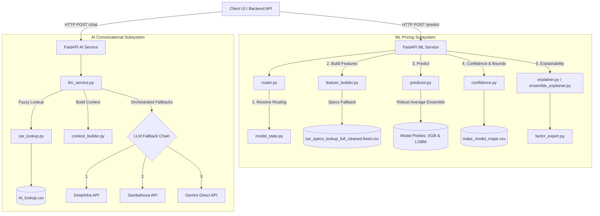
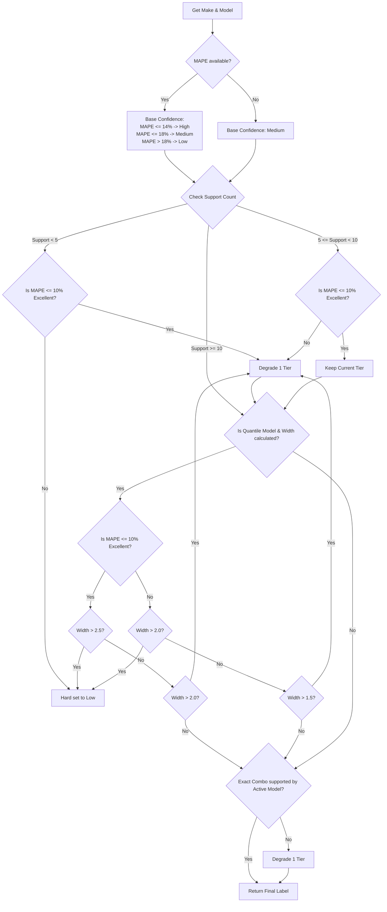
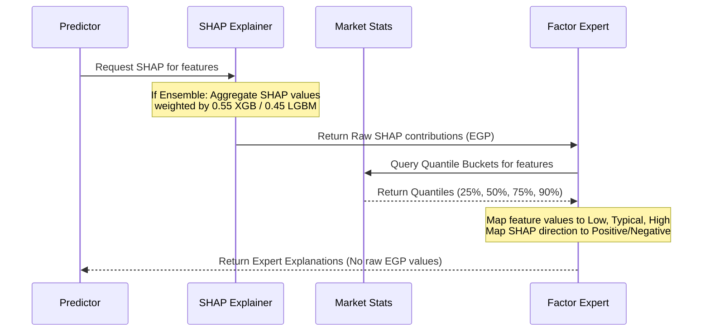
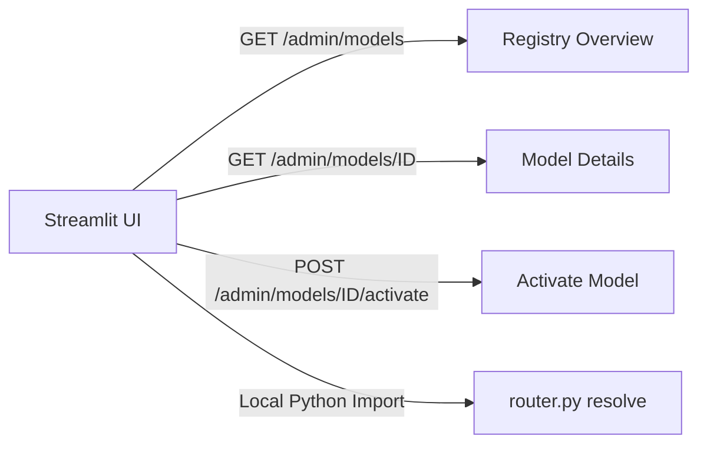
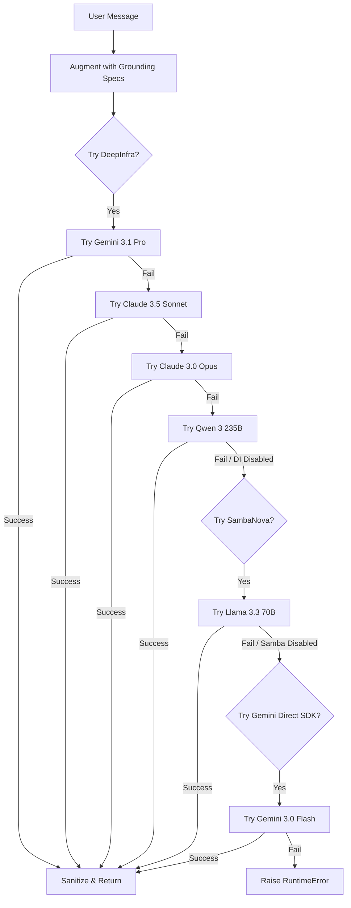

# 4. System Implementation

This chapter details the technical implementation, architecture, algorithms, and workflows of the server-side Machine Learning (ML) pricing service (`ml-service`) and the Conversational Artificial Intelligence (AI) service (`ai-service`). 

---

## 4.1 Software Architecture (Server-side ML/AI)

The system adopts a decoupled, microservices-based architecture where the ML pricing engine and the AI assistant run as separate services. Both are implemented in Python using the FastAPI framework, allowing high-throughput, low-latency, and asynchronous execution.



### 4.1.1 Model Family and Inference Pipeline

The active core model family is a **frozen ensemble** composed of gradient boosted decision trees:
1.  **Extreme Gradient Boosting (XGBoost)**: Optimized for handling tabulations and non-linear interactions.
2.  **Light Gradient Boosting Machine (LightGBM)**: Designed for high efficiency and natively supporting categorical features.

The inference pipeline loads these models as a unified `ModelContext` object from the registry.

```python
# Definition of ModelContext in app/services/model/model_state.py
@dataclass
class ModelContext:
    model_id: str
    version: str
    framework: str
    is_quantile: bool
    is_log_target: bool
    models: dict[str, Any] | Any  # Sub-models or model object
    metadata: dict[str, Any]
    coverage: set[tuple[str, str]] | None
    diagnostics: dict[tuple[str, str], float] | None
```

During service startup, the active model is loaded globally:
- If `framework == "ensemble"`, the ensemble wrapper file (`ensemble_<tag>.joblib`) is loaded. This wrapper contains relative paths to the underlying sub-models.
- Sub-models (e.g., `xgb_quantile_<tag>.joblib` and `lgbm_quantile_<tag>.joblib`) are loaded lazily upon the first prediction request and cached in-memory.

### 4.1.2 Feature Engineering Approach and Spec-Merge Fallback

The raw inputs received by the prediction endpoint (brand/make, model, year, mileage, transmission, fuel, location) must be aligned with the 15 features used during model training. This is handled by `feature_builder.py`.

#### Feature Column Definitions
- **Numerical Features (`NUM_COLS`)**: `year`, `mileage_km`, `mileage_per_year`, `engine_cc`, `horsepower`, `seating_capacity`
- **Categorical Features (`CAT_COLS`)**: `make`, `model`, `transmission`, `fuel`, `location`, `body_type`, `drivetrain`, `brand_origin`, `car_segment`
- **Total Input Features (`FEATURE_COLS`)**: Union of the above (15 features).

#### Text Normalization and Canonicalization
Inputs undergo standardizing steps before matching:
1.  **Transmission Mapping**: Normalizes values like `"auto"`, `"stick"`, or `"manual"` to `"Automatic"` or `"Manual"`.
2.  **Fuel Mapping**: Normalizes values to `"petrol"`, `"diesel"`, `"hybrid"`, or `"electric"`.
3.  **Canonicalization**: A mapping is generated from the lookup database:
    $$\text{Key: } (\text{make.lower()}, \text{model.lower()}) \rightarrow \text{Value: } (\text{cased\_make}, \text{cased\_model})$$
    This prevents casing mismatch errors (e.g., converting user input `bmw 116` to `BMW 116` instead of blindly applying `.title()` which would yield the incorrect `Bmw 116`).

#### The 5-Priority Specs Fallback Chain
If specs like `engine_cc`, `horsepower`, `body_type`, `drivetrain`, or `seating_capacity` are missing from the API request, the system queries the local knowledge base `car_specs_lookup_full_cleaned.fixed.csv` using a 5-tier fallback hierarchy:

```python
def _find_spec(lookup: pd.DataFrame, make: str, model: str, year: int) -> pd.Series | None:
    # Tier 1: Exact Make, Model, and Year
    match = lookup[(lookup["make"] == make) & (lookup["model"] == model) & (lookup["year"] == year)]
    if len(match) > 0:
        return match.iloc[0]

    # Tier 2: Same Make and Model, Nearest Year
    candidates = lookup[(lookup["make"] == make) & (lookup["model"] == model)]
    if len(candidates) > 0:
        idx = (candidates["year"] - year).abs().idxmin()
        return candidates.loc[idx]

    # Tier 3: Same Make, Median/Mode aggregate specs
    make_candidates = lookup[lookup["make"] == make]
    if len(make_candidates) > 0:
        num_agg = make_candidates.median(numeric_only=True)
        mode_df = make_candidates.mode(dropna=True)
        if len(mode_df) > 0:
            cat_agg = mode_df.iloc[0]
            return num_agg.combine_first(cat_agg)
        return num_agg

    # Tiers 4 & 5: Falls back to Global Defaults (Handled by caller)
    return None
```
- **Tier 4 (Segment Fallback)**: If no matching brand is found, segment-level defaults are resolved.
- **Tier 5 (Global Defaults)**: Hardcoded fallback values are applied to fill any remaining empty values:
  ```python
  defaults = {
      'engine_cc': 1500, 'horsepower': 100, 'seating_capacity': 5,
      'body_type': 'Sedan', 'drivetrain': 'FWD', 'brand_origin': 'other',
      'car_segment': 'family', 'transmission': 'Manual', 'fuel': 'petrol',
      'location': 'Cairo', 'mileage_km': 50000, 'mileage_per_year': 10000,
  }
  ```

#### Categorical Encoding for Inference
- **LightGBM**: Categorical columns are cast to pandas `category` dtype.
- **XGBoost**: Uses a pre-compiled `label_encoders.joblib` to map values to integers. If an unseen category is parsed, it is assigned a default index of `-1`.

### 4.1.3 Evaluation Metrics Methodology

Model evaluation during offline retraining uses standard regression metrics calculated on a holdout test set (20% split) and through 5-Fold Cross-Validation:

1.  **Mean Absolute Error (MAE)**:
    $$\text{MAE} = \frac{1}{n} \sum_{i=1}^{n} |y_i - \hat{y}_i|$$
2.  **Root Mean Squared Error (RMSE)**:
    $$\text{RMSE} = \sqrt{\frac{1}{n} \sum_{i=1}^{n} (y_i - \hat{y}_i)^2}$$
3.  **Mean Absolute Percentage Error (MAPE)**:
    $$\text{MAPE} = \frac{100\%}{n} \sum_{i=1}^{n} \left| \frac{y_i - \hat{y}_i}{y_i} \right|$$
4.  **Within 15% Error Range**: The percentage of predictions where the absolute error is less than or equal to 15% of the actual price:
    $$\text{Within\_15pct} = \frac{100\%}{n} \sum_{i=1}^{n} \mathbb{I}\left( \left| \frac{y_i - \hat{y}_i}{y_i} \right| \le 0.15 \right)$$
5.  **Coefficient of Determination ($R^2$)**:
    $$R^2 = 1 - \frac{\sum (y_i - \hat{y}_i)^2}{\sum (y_i - \bar{y})^2}$$

All metrics are tracked globally and segmented by pricing tiers: **Low** (<200k EGP), **Medium** (200k–600k EGP), and **High** (>600k EGP). 

Additionally, per-make-model metrics are saved in `make_model_mape.csv`. During serving, the system loads this CSV into memory (`SUPPORT_COUNTS_MM` and `MAPE_MM` dictionaries) to evaluate prediction confidence.

### 4.1.4 Confidence Label Computation

The confidence scoring module (`confidence.py`) classifies predictions into `high`, `medium`, or `low` confidence using a rule-based degradation system:



### 4.1.5 Negotiation Interval / Range Logic

To calculate a realistic negotiation range, the system adjusts the point prediction (`fair_price`) based on the confidence score and the historical MAPE of the vehicle group.

#### Formulation
Let the margin parameter be $\alpha$:
$$\alpha = \max\left(\frac{\text{MAPE}_{\text{car}}}{100} \times C_{\text{multiplier}}, \text{MinBand}_{\text{tier}}\right)$$

The negotiation bounds are:
$$\text{Lower Price} = \max(0, \text{Fair Price} \times (1 - \alpha))$$
$$\text{Upper Price} = \text{Fair Price} \times (1 + \alpha)$$

#### Configuration Constants
| Confidence Tier | Multiplier ($C_{\text{multiplier}}$) | Minimum Band ($\text{MinBand}_{\text{tier}}$) |
| :--- | :--- | :--- |
| **High** | $1.00$ | $0.12$ ($12\%$) |
| **Medium** | $1.35$ | $0.18$ ($18\%$) |
| **Low** | $1.85$ | $0.25$ ($25\%$) |

#### Price Rounding Rules (`price_rounding.py`)
To align predictions with real-world Egyptian transaction habits, the final prices are rounded dynamically:
-   **If Price < 200,000 EGP**: Round to the nearest **5,000 EGP** (e.g., $182,300 \rightarrow 180,000$).
-   **If Price $\ge$ 200,000 EGP**: Round to the nearest **10,000 EGP** (e.g., $346,000 \rightarrow 350,000$).

### 4.1.6 Explainability via SHAP (SHapley Additive exPlanations)

The explainability layer details the factors driving the prediction using Shapley values.



1.  **SHAP Aggregation**: For the ensemble model, `ensemble_explainer.py` computes SHAP values for both LightGBM and XGBoost models separately, then combines them using the model weights ($0.55 \times \text{SHAP}_{\text{XGB}} + 0.45 \times \text{SHAP}_{\text{LGBM}}$).
2.  **Quantile Categorization**: To make explanations intuitive, numerical input features are mapped to percentile buckets derived from `market_stats.py`:
    -   *Low*: $<25^{\text{th}}$ percentile
    -   *Typical*: $25^{\text{th}} - 75^{\text{th}}$ percentile
    -   *High*: $75^{\text{th}} - 90^{\text{th}}$ percentile
    -   *Very High*: $>90^{\text{th}}$ percentile
3.  **Deterministic Explanations**: `factor_expert.py` maps these feature buckets and SHAP directions to localized market statements:
    -   *Example (High Mileage, Negative SHAP)*: `"Very high mileage by Egyptian standards. Buyers will expect significant cumulative wear and will negotiate hard."`
    -   *Example (Recent Model Year, Positive SHAP)*: `"This is a very recent model year — still within or near the official warranty period. Buyers expect near-showroom condition..."`

### 4.1.7 Model Registry and Promotion Gates

All models are tracked inside `model_registry.json`.

```json
{
  "active_model_id": "ensemble_20260612_1045",
  "active_version": "v2.1.2",
  "models": {
    "ensemble_20260612_1045": {
      "model_id": "ensemble_20260612_1045",
      "version": "v2.1.2",
      "stage": "production",
      "framework": "ensemble",
      "dataset_tag": "20260612_main",
      "registered_at": "2026-06-12T10:45:00Z",
      "metrics": {
        "MAPE_pct": 11.23,
        "MAE": 42000,
        "R2": 0.892
      }
    }
  }
}
```

During model retraining, the model's metrics are evaluated against the threshold-only rules defined in `gates.py`:
-   `max_holdout_mape_pct` $\le 15.0\%$
-   `min_holdout_r2` $\ge 0.80$
-   `min_holdout_within_15pct` $\ge 70.0\%$
-   `max_cv_mape_pct` $\le 15.0\%$
-   `max_supported_pct_above_30pct` $\le 10.0\%$ (Percentage of supported cars with error > 30%)
-   `max_supported_pct_above_50pct` $\le 2.0\%$ (Percentage of supported cars with error > 50%)

If any threshold is breached, the model is registered as a `candidate_only` artifact and cannot be promoted to `production`. A hard holdout MAPE $>50.0\%$ results in a `reject` classification.

### 4.1.8 ML Admin Dashboard UI (Streamlit)

The administrator dashboard (`admin/dashboard.py`) is a Streamlit interface that interacts with the FastAPI admin endpoints.



1.  **Registry Overview**: Displays key metrics (active model, total models, latest candidate, active version) and lists all registered models with their training metrics in a styled Pandas DataFrame.
2.  **Model Details**: Allows inspecting the active metrics, diagnostics summaries, and the raw metadata JSON of a chosen model.
3.  **Compare Models**: Compares metrics between two models in a side-by-side table.
4.  **Activate Model**: Sends a POST request to the admin activation endpoint to dynamically load a new model into the live server memory.
5.  **Coverage Explorer**: Imports the live routing modules (`resolve_model_for_prediction` from `router.py`) to let admins test how a specific brand/model inputs will route through the system.

---

## 4.2 Workflow / Pseudocode (ML/AI Pipeline)

### 4.2.1 Data Cleaning Scripts and Versioned Pipeline Execution

Before training, raw data undergoes cleaning and validation:
1.  **Outlier Removal**: Removes listings with invalid prices (e.g., <20,000 EGP or >5,000,000 EGP) and unrealistic mileages (e.g., >500,000 km).
2.  **Text Standardization**: Strips special characters, normalizes Arabic characters, and maps locations to standard Egyptian governorate names.
3.  **Feature Ingestion**: Joins the dataset with the specs lookup sheet to fill missing technical values.
4.  **Validation**: Ensures the processed DataFrame matches the required schema (`validate_dataframe`):
    - All categorical and numerical feature columns must be present.
    - No infinite numerical values are permitted.

### 4.2.2 Production Inference Flow

When a client requests a price prediction through the FastAPI `/predict` endpoint:

```
[Client Request]
       │
       ▼
[Pydantic Validation] ──(Fails)──► [422 Error]
       │
       ▼
[Resolve Routing] 
  (Make Unknown?) ──────(Yes)────► [400 Validation Error]
       │ (No)
       ▼
[Feature Engineering] (5-Priority Fallback & Categ. Casting)
       │
       ▼
[Parallel Inference] (XGBoost & LightGBM Predict)
       │
       ▼
[Ensemble Aggregation] (Robust Average / Trimming)
       │
       ▼
[Confidence Scoring] (Support & Interval Checks)
       │
       ▼
[Negotiation Bands] (Apply Multipliers & Min Bands)
       │
       ▼
[SHAP Explanations] (Compute values & translate via Factor Expert)
       │
       ▼
[Rounding & Clean] (Apply EGP rounding & sanitize text)
       │
       ▼
[JSON Response]
```

### 4.2.3 Retrain Orchestration Runner

The offline retraining script (`run.py`) runs the following workflow step-by-step:

```python
def run_retrain(config: RetrainConfig) -> dict:
    # 1. Resolve workspace root & setup outputs
    ml_root = find_ml_root()
    paths = _artifact_paths(_output_tag(config), ml_root)
    cache_dir = _cache_dir(_output_tag(config), ml_root)
    
    # 2. Load dataset & validate schema
    df = load_data(config.dataset_tag, override_path=config.data_path)
    validate_dataframe(df)
    
    # 3. Split dataset (Train/Val/Test)
    splits = split_for_training(df, split_name=config.split_name)
    
    # 4. Train quantile Models (XGBoost & LightGBM)
    artifact = train_frozen_ensemble(splits, FEATURE_COLS, CAT_COLS, NUM_COLS, target_col=config.target_col)
    
    # 5. Predict on holdout test set
    ensemble_preds = predict_ensemble(artifact, splits.test_df, config.target_col)
    
    # 6. Evaluate Holdout Metrics
    holdout_metrics = evaluate_holdout(splits.test_df[config.target_col], ensemble_preds)
    per_tier = evaluate_per_tier(splits.test_df, ensemble_preds)
    per_mm = evaluate_per_make_model(splits.test_df, ensemble_preds["median"])
    diag_summary = threshold_summary(per_mm)
    
    # 7. Run Out-of-Fold 5-Fold Cross Validation
    cv_result = run_kfold_cv(df, target_col=config.target_col)
    cv_metrics = cv_result["overall_metrics"]
    
    # 8. Check Promotion Gates
    gate = check_gate(holdout_metrics, cv_metrics, diag_summary)
    
    # 9. Register & Promote if gates pass
    next_version = _next_v2_version()
    model_id = register_model(
        model_id=f"ensemble_{_output_tag(config)}",
        version=next_version,
        framework="ensemble",
        dataset_tag=config.dataset_tag,
        metrics=holdout_metrics,
        stage="production" if gate.passed and not config.no_promote else "candidate"
    )
    _save_model_pickles(artifact, paths, ml_root)
    
    if gate.passed and not config.no_promote:
        promote_active_model(model_id)
        
    return {"status": "success", "model_id": model_id, "gate_outcome": gate.outcome}
```

### 4.2.4 AI-Service Provider Fallback Logic

The conversational service (`ai-service`) implements a hierarchical fallback mechanism to ensure uninterrupted responses.



To prevent slow response times during failure chains, HTTP timeout constraints are enforced via the `timeout` parameter set in `chatbot_prompts.yaml` (typically $10.0$ seconds).

### 4.2.5 Grounding / Lookup Behavior

The RAG pipeline intercept's messages to fetch verified specification details:

1.  **Query Classification**: `car_lookup.py` analyzes the text to determine if it is a search query or a specific vehicle request.
2.  **Entity Matching**:
    -   *Regex Extraction*: Extracts numeric parameters like model year (e.g., `2021` or `٢٠٢١`) and engine capacity (e.g., `1600cc` or `١٦٠٠ سي سي`).
    -   *Regex Differentiators*: Searches for transmissions (e.g., automatic or manual) and body types in Arabic or English.
    -   *Fuzzy Matching*: Uses `rapidfuzz` to match the brand and model names against the `AI_lookup.csv` sheet:
        ```python
        score = fuzz.token_set_ratio(normalized_user_msg, candidate_car_name)
        ```
3.  **Context Construction**:
    -   *Specs Lookup*: Returns verified specs (engine size, horsepower, transmission, fuel, segment) and appends relevant Egyptian market notes (e.g., parts availability).
    -   *Search Queries*: Formats matching search examples into a context string:
        ```
        VERIFIED SPECS (from our lookup dataset snapshot):
        Car: Hyundai Elantra
        - 2017: 1600cc, 127hp, Automatic, Petrol, Sedan, FWD, 5 seats, Asian, family
        - 2018: 1600cc, 127hp, Automatic, Petrol, Sedan, FWD, 5 seats, Asian, family
        Egypt market note (curated):
        - Highly popular in Egypt; resale is extremely fast. Parts are cheap and available everywhere.
        IMPORTANT: Use ONLY the verified specs above when stating specs...
        ```
    -   The system inserts this context block at the top of the prompt:
        `[VERIFIED CONTEXT BLOCK] \n\n User question: [Original User Message]`

### 4.2.6 Post-Processing and Output Formatting

The model's raw output is sanitized inside `_sanitize_response_text` before returning:

1.  **Reasoning Block Stripping**: Removes thinking segments (e.g., `<think>...</think>`) output by reasoning models using a regex pattern.
2.  **Character Script Filtering**:
    - Removes Chinese/Japanese/Korean (CJK) characters.
    - If the user wrote in Arabic, the system strips out Latin diacritics/accents using NFKD normalization, while preserving Arabic characters and English-script automotive terms.
    - If the user wrote in English, the system strips out all non-ASCII characters (including Arabic characters).
3.  **Punctuation and Typography Standardization**: Replaces smart quotes (`“`, `”`), dashes (`—`), and non-standard currency symbols (`£`) with clean ASCII equivalents (`"`, `-`, `EGP`).
4.  **Whitespace Compression**: Replaces multiple spaces and tabs with a single space, and limits consecutive newlines to a maximum of two.
